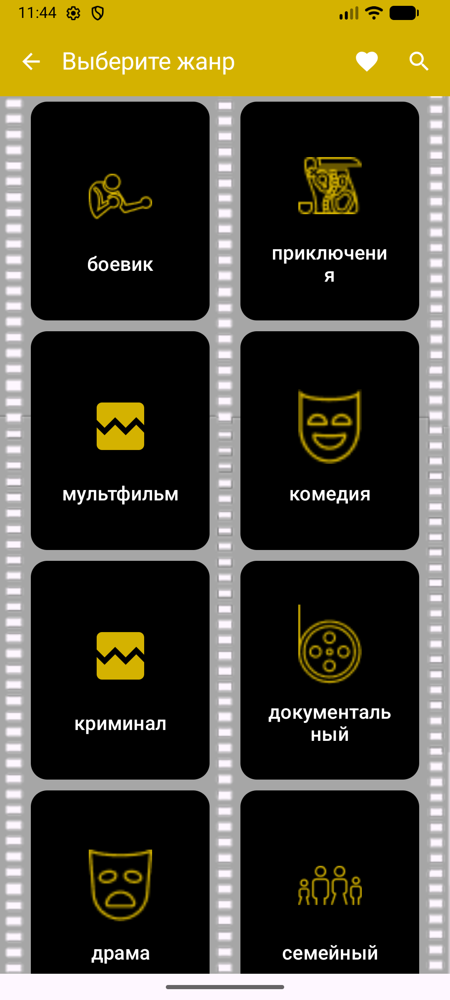
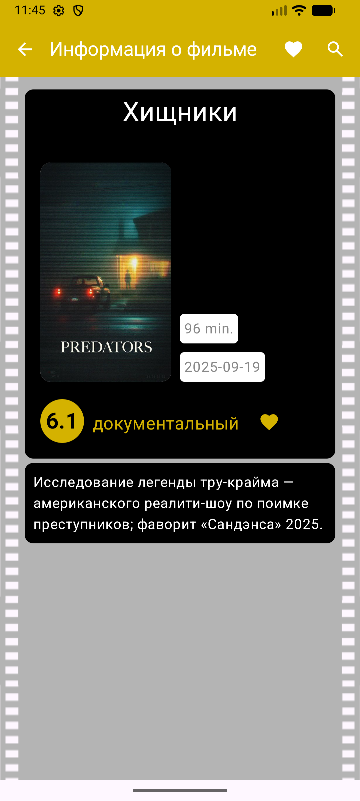
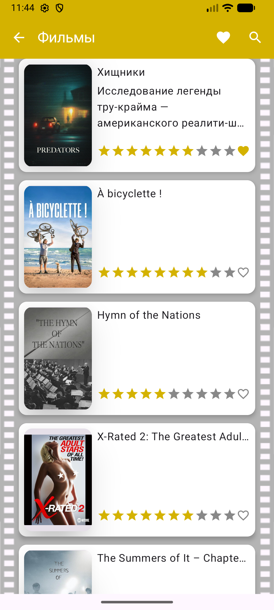

# MovieAndroid — TMDB Explorer

**MovieAndroid** — это мобильное приложение для поиска и просмотра информации о фильмах, использующее API [The Movie Database (TMDB)](https://www.themoviedb.org/documentation/api). Проект создан как демонстрация навыков актуальной Android-разработки: декларативный UI, реактивное программирование и чистая архитектура.

---

## Скриншоты
<p align="center">
  
  
  
</p>
<p align="center">
  
  
</p>

---

## Основные возможности
- **Каталог жанров:** Загрузка актуального списка жанров напрямую из TMDB.
- **Интеллектуальный поиск:** Поиск фильмов по названиям в реальном времени.
- **Интерактивный UI:** Обработка состояний загрузки (Loading) и ошибок (Error).
- **Динамическая локализация:** Поддержка смены языков (LocaleUtils).

---

## Технологический стек

### Core & UI
- **Kotlin** + **Coroutines & Flow** - асинхронщина и управление потоками данных.
- **Jetpack Compose** - полностью декларативный интерфейс.
- **Material Design 3** - современная дизайн-система.
- **Coil** - асинхронная загрузка изображений с поддержкой кэширования.

### Data & Networking
- **Retrofit 3** - типобезопасный HTTP-клиент для работы с TMDB API.
- **Kotlinx Serialization** - современный и быстрый парсинг JSON.
- **OkHttp Logging Interceptor** - отладка сетевого трафика.

### Architecture
- **MVVM (Model-View-ViewModel)** - четкое разделение бизнес-логики и UI.
- **Repository Pattern** - абстракция источников данных (GenresRepository).
- **Manual Dependency Injection** - реализация контейнера зависимостей (App Container) без лишнего оверхеда.
- **Sealed Interfaces** - строгое управление состояниями экрана (`UiState`).

---

## Архитектура приложения
Приложение построено на принципах **Unidirectional Data Flow (UDF)**:
1. **Data Layer:** Репозитории запрашивают данные через Retrofit.
2. **ViewModel:** Получает данные, обрабатывает ошибки через `try-catch` и обновляет `MutableStateFlow`.
3. **UI Layer (Compose):** Подписывается на `StateFlow` и автоматически перерисовывается при изменении данных.

Пример обработки состояний из проекта:
```kotlin
sealed interface GenresUiState {
    data class Success(val genres: List<GenreDTO>) : GenresUiState
    object Error : GenresUiState
    object Loading : GenresUiState
}
```

---

## План развития (Roadmap)
- [ ] **Локальное хранилище:** Внедрение **Room Persistence** для работы в офлайн-режиме и списка "Избранное".
- [ ] **Unit & UI Testing:** Покрытие кода тестами с использованием MockK и Compose Test Library.
- [ ] **DI Framework:** Миграция на **Dagger Hilt** для автоматизации внедрения зависимостей.
- [ ] **Детальные экраны:** Страница фильма с актерами, рейтингами и видео-трейлерами.
